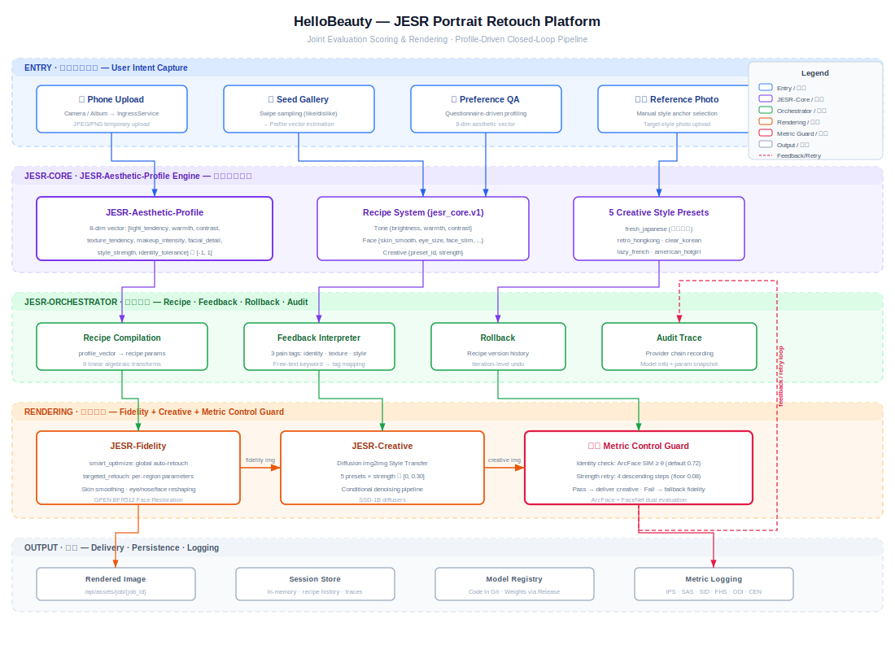

# HelloBeauty 🪞

> **JESR Portrait Retouch Platform** — Joint Evaluation Scoring & Rendering for Automated Portrait Retouch  
> An AIGC-powered intelligent photo beauty retouching system

[](LICENSE)
[](https://www.python.org/)
[](https://www.typescriptlang.org/)
[](https://fastapi.tiangolo.com/)
[](https://github-com.translate.goog/ljun95255-netizen/HelloBeauty?_x_tr_sl=en&_x_tr_tl=zh-CN&_x_tr_hl=zh-CN)

**HelloBeauty** is an AIGC-powered portrait retouch platform that replaces traditional filter-based workflows with a **perception → decision → execution pipeline**. It introduces the **JESR-Aesthetic-Profile** — an 8-dimensional feature vector that bridges user intent to rendering parameters — and a **metric-controlled guard** that ensures identity preservation during generative edits.

---

## System Architecture



The pipeline has five layers:

| Layer | Components | Responsibility |
|:---|:---|:---|
| **Entry** | Phone Upload · Seed Gallery · Preference QA · Reference | User intent via swipe, questionnaire, or reference photos |
| **JESR-Core** | Aesthetic Profile Engine · Recipe System · Style Presets | 8-dim profile vector → parameterized recipe (tone/face/creative) |
| **Orchestrator** | Recipe Compilation · Feedback · Rollback · Audit Trace | Stateful SISO loop: iterate → feedback → update → re-render |
| **Rendering** | JESR-Fidelity · JESR-Creative · Metric Control Guard | Smart optimize + targeted retouch → diffusion img2img → identity check |
| **Output** | Image Delivery · Session Store · Model Registry · Logging | Rendered result via `/api/assets/job/{id}` |

### JESR-Aesthetic-Profile Vector

The profile encodes user aesthetic preferences in 8 continuous dimensions (range [−1, 1]):

| Dimension | Description |
|:---|:---|
| `light_tendency` | Preference for bright vs. dark tone |
| `warmth` | Warm vs. cool color temperature |
| `contrast` | High vs. low contrast |
| `texture_tendency` | Preference for skin texture preservation |
| `makeup_intensity` | Makeup strength (lip color, eye emphasis) |
| `facial_detail_preference` | How much facial reshaping is acceptable |
| `style_strength` | Creative style transfer intensity |
| `identity_tolerance` | Acceptable identity drift |

### Metric Control Guard

Before delivering creative (diffusion img2img) output, the system evaluates identity similarity via ArcFace / FaceNet. If similarity drops below threshold, it retries with progressively reduced denoising strength (4 descending steps, floor 0.08). On all failures, it falls back to the fidelity output — ensuring **identity is never compromised for style**.

---

## Repository Structure

```
HelloBeauty/
├── backend/
│   ├── api/              # FastAPI routes (sessions, photos, recipes, render, models, assets)
│   ├── jesr/             # JESR-Orchestrator, Metric Control, Feedback, Recipe Trace
│   ├── providers/        # JESR-Fidelity / JESR-Creative provider interfaces
│   ├── services/         # Session store, storage, ingress (photo upload)
│   └── app.py            # FastAPI application entry point
├── packages/
│   ├── jesr_core/        # Python: JESR-Aesthetic-Profile engine & recipe system
│   ├── domain/           # TypeScript: shared domain types (JESR interfaces, metrics)
│   ├── api-client/       # TypeScript: transport-agnostic API client
│   └── design-tokens/    # Shared design tokens
├── apps/
│   ├── mini/src/         # Taro mini-app (swipe UI, retouch pages, API utils)
│   └── web/app/          # Next.js marketing/landing page
├── tests/                # pytest + API contract tests
├── docs/images/          # Architecture diagram
├── scripts/              # Startup script
└── pyproject.toml / package.json / tsconfig.base.json
```

---

## Key Innovations

### 1. Profile-Driven Recipe Compilation
User preferences (from swipe sampling or questionnaire) are not treated as direct sliders. Instead, the 8-dim profile vector maps through **8 linear algebraic transforms** into tone, face, and creative parameters — ensuring cross-dimensional consistency.

### 2. SISO Feedback Loop with Rollback
Each render produces an audit trace. The feedback interpreter maps both structured pain tags and free-text input to recipe deltas. Every iteration is versioned — the rollback API can restore any prior state.

### 3. Identity-Guarded Diffusion
The metric control loop evaluates identity similarity (≥θ threshold) before accepting creative output. When identity degrades, it retries with reduced strength (4-step descent) and falls back to fidelity on guard failure.

### 4. Model Distribution: Code in Git, Weights via Release
Model manifests and adapter code live in the repository. Model weights (GPEN, SSD-1B) are distributed as GitHub Release assets, mounted at runtime — **no large binary files in Git history**.

---

## Tech Stack

| Layer | Technology |
|:---|:---|
| Backend API | Python 3.10+ · FastAPI · Uvicorn |
| JESR-Core | Python (pure algorithm — no NumPy dependency) |
| Rendering | GPEN BFR512 (face restoration) · SSD-1B diffusers (style transfer) |
| Identity Metric | ArcFace · FaceNet |
| Frontend Mini | TypeScript · Taro 3.x · React |
| Frontend Web | Next.js · React |
| Packages | TypeScript monorepo (shared domain types) |

---

## Quick Start

### Prerequisites
- Python 3.10+ with `pip`
- Node.js 20+
- Model weights downloaded as GitHub Release assets

### Start Backend
```bash
# Install Python deps
pip install -e packages/jesr_core
pip install fastapi uvicorn pillow

# Start API server
bash scripts/start_backend.sh
# → API: http://127.0.0.1:7860/docs
# → Health: http://127.0.0.1:7860/api/health
```

### Run Tests
```bash
python -m pytest tests -q
```

### Frontend (Mini App)
```bash
npm install
npm run build:mini
```

---

## What's Included & What's Not

### ✅ Included
- Full API route surface — all endpoints and contracts
- JESR Orchestrator and Metric Control core algorithms
- JESR-Aesthetic-Profile engine (8-dim profile vector with mathematical transforms)
- TypeScript domain type definitions and API client interfaces
- Key frontend pages for architecture reference
- Test files demonstrating API contracts
- Architecture diagram

### ❌ Not Included
- **Model Weights** — GPEN BFR512, SSD-1B, ArcFace distributed via GitHub Releases
- **Model Adapters** — `backend/model_adapters/` with model-specific command paths
- **Model Registry** — `backend/models/` with version hashes and metadata
- **Render Worker** — `backend/workers/` background rendering logic
- **Experiment Scripts** — `scripts/run_real_metric_experiments.py` (117 KB)
- **Vendor Libraries** — `vendor/` and `npm/` directories
- **Beauty Gallery** — `beauty/` sample portrait photos
- **Complete IDE Project** — representative pages only, not a fully buildable project

> **Design Intent:** This repository demonstrates system architecture, core algorithms, and API contracts — sufficient to understand the JESR system design but not directly clone-and-run. Model weights and complete project files are distributed through other channels.

---

## License

Apache 2.0 © 2024 HelloBeauty Contributors. See [LICENSE](LICENSE).
